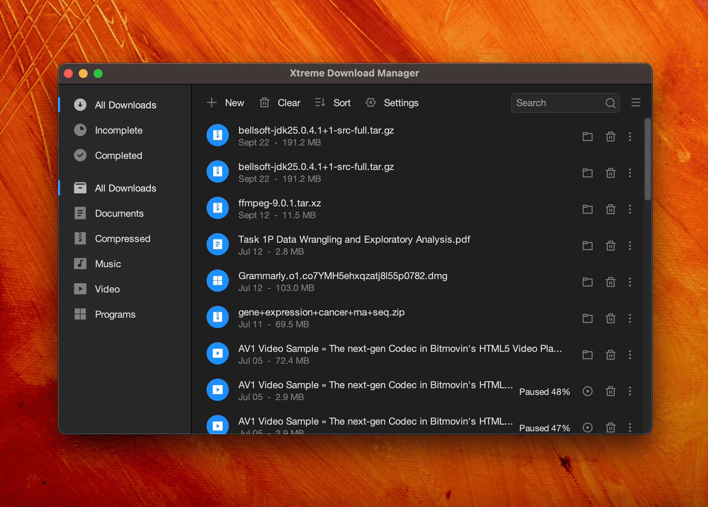
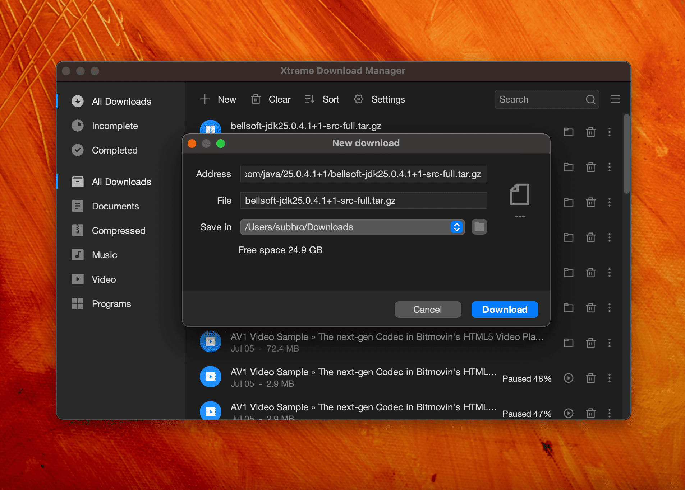
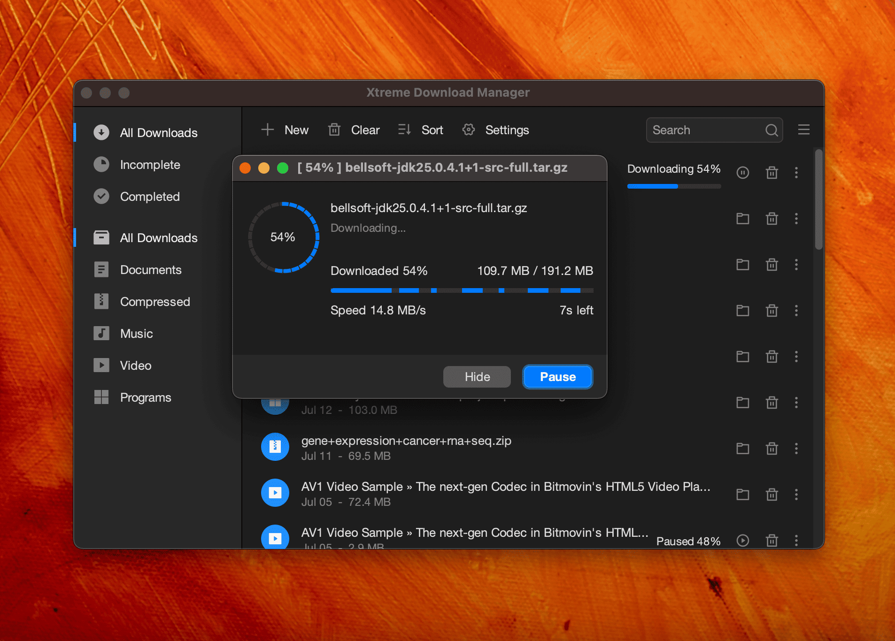

<p align="center">
  
</p>

<h1 align="center">Xtreme Download Manager</h1>

<p align="center">
  <b>Fast, resumable downloads and one-click video grabbing — right from your browser.</b>
</p>

<p align="center">
  <a href="https://github.com/subhra74/xdm/releases"></a>
  <a href="https://github.com/subhra74/xdm/releases/latest"></a>
  
  
</p>

<p align="center">
  <a href="https://xtremedownloadmanager.com/">Homepage</a> ·
  <a href="https://xtremedownloadmanager.com/#downloads">Download</a> ·
  <a href="#-features">Features</a> ·
  <a href="#-browser-integration">Browser integration</a> ·
  <a href="#-building-from-source">Build</a> ·
  <a href="#-translations">Translations</a>
</p>

<p align="center">
  <a href="https://xtremedownloadmanager.com/#downloads"></a>
</p>

---

**Xtreme Download Manager (XDM)** speeds up downloads by splitting them across multiple connections, saves videos
from streaming sites, and picks up broken downloads exactly where they left off. A companion browser extension hands
downloads and detected videos straight to the app, so you never have to copy a link by hand.

> [!NOTE]
> As of 2026 XDM is being rebuilt and is in **active development**.

## 📸 Screenshots

| Main window | New download | Download progress |
|:---:|:---:|:---:|
|  |  |  |

## ✨ Features

| | |
|---|---|
| ⚡ **Faster downloads** | Multi-connection segmented downloading to make the most of your bandwidth. |
| 🎬 **Video grabber** | Detects and saves videos from streaming sites, including `HLS` (`.m3u8`) and `MPEG-DASH` (`.mpd`) streams, muxed to MP4 with no external tools. |
| 🔁 **Resume anything** | Recovers downloads interrupted by network drops, crashes or power loss; refresh expired links without starting over. |
| 📦 **Batch downloads** | Grab many links at once into a single folder. |
| 🗓️ **Scheduler & queues** | Start and stop downloads on a schedule, limit parallel downloads, shut down when done. |
| 📋 **Paste from clipboard** | Add one link or a whole list of links straight from the clipboard. |
| 🌐 **Proxies & auth** | HTTP and SOCKS proxies, and server/proxy authentication. |
| 🛡️ **Antivirus scan** | Optionally scan finished downloads with your antivirus. |
| 🖥️ **Cross-platform** | Native-feeling app on Windows, macOS and Linux, with light and dark themes. |

## 🧩 Browser integration

XDM works with Chrome, Firefox, Edge, Opera, Vivaldi, Brave and other Chromium- and Firefox-based browsers.

| Browser | Extension |
|---|---|
|  | Awaiting review |
|  | Awaiting review |

The extension forwards downloads and detected media to the running app over a local-only connection
(`127.0.0.1:8597`); nothing leaves your machine.

## 🛠️ Building from source

**Requirements:** JDK 25 (configured as a [Maven toolchain](packaging/toolchains.sample.xml)) and Maven.

```bash
# 1. Point Maven at your JDK 25
cp packaging/toolchains.sample.xml ~/.m2/toolchains.xml   # then edit jdkHome

# 2. Build the app (fat jar: xdm-app/target/xdm-app.jar)
mvn -q -pl xdm-app -am package

# 3. Run it
java -jar xdm-app/target/xdm-app.jar
```

| Module | What it is |
|---|---|
| `xdm-core` | Download engine (HTTP, HLS, DASH, batch), no UI dependencies, JDK 8 compatible |
| `xdm-app` | Swing desktop app (FlatLaf) and browser-integration server |
| `browser-extension` | Chrome and Firefox extensions |

## 🌍 Translations

Want XDM in your language? Translations are welcome — see
[Submitting translations for XDM](https://github.com/subhra74/xdm/wiki/Submitting-translations-for-XDM).

---

<p align="center">
  Made with ☕ by <a href="https://github.com/subhra74">subhra74</a> and contributors ·
  <a href="https://xtremedownloadmanager.com/">xtremedownloadmanager.com</a>
</p>
